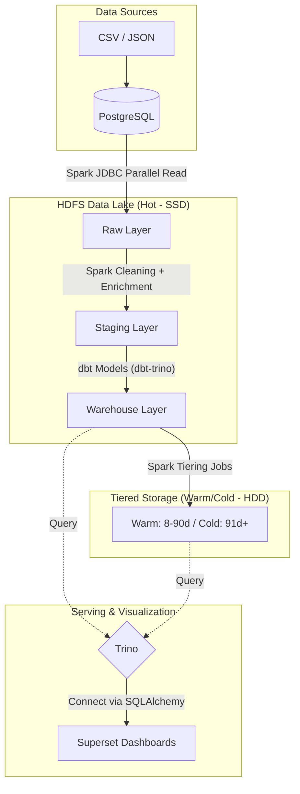

# MoMo Fraud Detection — Data Engineering Pipeline

Enterprise-grade batch data pipeline cho bài toán fraud detection tại fintech.

## Tech Stack

| Layer | Tool |
|---|---|
| Source DB | PostgreSQL 14 |
| Processing | Apache Spark 3.5 (PySpark) |
| Storage | HDFS (Hadoop 3.2) + Tiered SSD/HDD |
| Catalog | Apache Hive Metastore 3.1 |
| Query Engine | Trino 435 |
| Transformation | dbt-trino 1.7 |
| Orchestration | Apache Airflow 2.8 |
| Visualization | Apache Superset 3.1 |
| Containerization | Docker Compose |

## Architecture



## Data Flow & Pipeline Stages

Dự án áp dụng mô hình ELT (Extract, Load, Transform) qua các chặng sau:
1. **Ingestion (Extract & Load):** Spark kết nối PostgreSQL qua JDBC Parallel Read để hút dữ liệu song song. Dữ liệu thô được ghi xuống HDFS (Raw Layer) dưới dạng nén Parquet với chế độ ghi an toàn (Idempotent / Dynamic Partition Overwrite).
2. **Staging (Clean & Enrich):** Spark đọc file Parquet từ Raw Layer, ép kiểu dữ liệu (Schema Enforcement), làm sạch (chuẩn hóa tiền tệ, bắt lỗi định dạng) và loại bỏ dữ liệu nhạy cảm (như mã CVV).
3. **Data Modeling (Transform):** dbt (sử dụng Trino engine) tổng hợp dữ liệu từ Staging thành các bảng Fact/Dimension (Warehouse) và các bảng OBT (Data Marts) để phục vụ Data Analytics.
4. **Serving & Visualization:** Apache Superset kết nối với Trino để truy vấn trực tiếp lên Data Lake, cung cấp các Dashboards giám sát gian lận.
5. **Storage Optimization:** Hệ thống có cơ chế phân tầng lưu trữ (Tiered Storage). Dữ liệu cũ tự động dịch chuyển từ SSD xuống HDD để tiết kiệm chi phí.

## Data Modeling (Kimball Methodology)

Lớp Data Warehouse được thiết kế chuẩn mực theo mô hình **Star Schema (Lược đồ hình sao)**:
- **Fact Table:** `fact_transactions` (Lưu lịch sử giao dịch thanh toán thay đổi liên tục).
- **Dimension Tables:** `dim_users`, `dim_cards`, `dim_merchants` (Lưu thông tin định danh ít thay đổi).
- **Data Marts (OBT - One Big Table):** Các bảng như `fraud_features`, `merchant_risk_score` được làm phẳng, dọn sẵn toàn bộ Features để đẩy trực tiếp vào Machine Learning Model mà không cần JOIN phức tạp.

## Advanced Processing Techniques

- **JDBC Parallel Read:** Spark tự động tính toán ID bounds để mở song song nhiều kết nối hút dữ liệu, tránh hiện tượng thắt cổ chai ở Source DB.
- **Amount Parser:** Xử lý triệt để bài toán đa định dạng tiền tệ quốc tế (vd: `$1,234.56`, `1.234,56`, `₫200,000`), chuẩn hóa về kiểu `Decimal(18,2)` để tránh sai số floating-point.
- **SCD Type 2 (Slowly Changing Dimensions):** Theo dõi và lưu vết toàn bộ lịch sử thay đổi thông tin (địa chỉ, điểm tín dụng) của User theo thời gian.
- **PCI-DSS Compliance:** Bắt buộc `drop` mã bảo mật thẻ tín dụng (`CVV`) ngay trên RAM ở chặng Ingestion. Không bao giờ ghi thông tin này ra ổ cứng.
- **Data Quality Gates:** Tích hợp `Great Expectations` để chặn đứng dữ liệu rác trước khi chúng kịp đi vào Warehouse.
- **Airflow Orchestration:** Lập lịch tự động hằng ngày (@daily), xử lý backfill tự động (catchup) và tự động gọi MSCK REPAIR để cập nhật metadata cho Hive.

## Quick Start

```bash
# 1. Download PostgreSQL JDBC driver + copy raw data
make download-jars
make copy-data

# 2. Start toàn bộ stack (KHÔNG dùng --build trừ lần đầu / khi đổi Spark/Hive image)
make up

# 2b. Cài dbt vào Airflow (1 lần, ~2–5 phút — bỏ qua nếu đã cài)
make airflow-install-dbt

# 3. Setup HDFS + Hive schemas
make hdfs-init
make hive-init

# 4. Chạy full pipeline end-to-end (static dataset backfill)
make pipeline
# hoặc: bash scripts/run_e2e.sh

# 5. (Tùy chọn) Kết nối Superset → Trino
make superset-init
```

### Sau khi `make up` — Airflow Spark connection (lần đầu)

```bash
docker exec airflow-webserver airflow connections add spark_default \
  --conn-type spark --conn-host spark-master --conn-port 7077
```

## Services sau khi chạy `make up`

| Service | URL | Credentials |
|---|---|---|
| HDFS Web UI | http://localhost:9870 | — |
| Spark Web UI | http://localhost:8081 | — |
| Trino UI | http://localhost:8082 | — |
| Airflow UI | http://localhost:8083 | admin/admin |
| Superset UI | http://localhost:8088 | admin/admin |
| Source DB | localhost:5432/momo_source | momo/momo |

## Directory Structure

| Folder | Description |
|---|---|
| `airflow/` | Airflow DAGs và cấu hình orchestration |
| `dbt/` | dbt models cho lớp Data Warehouse (dbt-trino) |
| `ingestion/` | Spark jobs để extract dữ liệu từ Source (JDBC parallel read) |
| `transformation/` | Spark jobs xử lý dữ liệu staging, data cleaning và compaction |
| `quality/` | Các script kiểm tra Data Quality (vd: Great Expectations) |
| `tests/` | Unit test và Integration test cho Spark jobs |
| `docker/` | Docker Compose và cấu hình các services (Trino, Hive, Superset...) |

## Data Quality & Testing
- **Data Quality (`quality/`)**: Tích hợp các kiểm tra chất lượng dữ liệu để đảm bảo tính toàn vẹn của data trước khi đưa vào Warehouse.
- **Testing (`tests/`)**: Bao gồm Unit Tests và Integration Tests cho các Spark jobs xử lý dữ liệu.

## Docs

- `myReadme.md` — engineering decisions log
