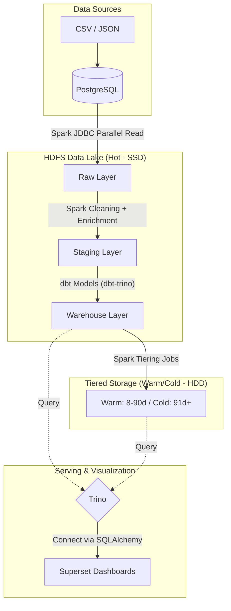

# MoMo Fraud Detection — Data Engineering Pipeline

Enterprise-grade batch data pipeline cho bài toán fraud detection tại fintech.

## Tech Stack

| Layer | Tool |
|---|---|
| Source DB | PostgreSQL 14 |
| Processing | Apache Spark 3.5 (PySpark) |
| Storage | HDFS (Hadoop 3.2) + Tiered SSD/HDD |
| Catalog | Apache Hive Metastore 3.1 |
| Query Engine | Trino 435 |
| Transformation | dbt-trino 1.7 |
| Orchestration | Apache Airflow 2.8 |
| Visualization | Apache Superset 3.1 |
| Containerization | Docker Compose |

## Architecture



## Key Features

- **JDBC Parallel Read** — 8 concurrent connections cho transactions table
- **Tiered Storage** — HDFS Storage Policy: SSD cho hot data, HDD cho warm/cold
- **Amount Parser** — xử lý multi-locale formats ($1,234.56 / 1.234,56 / ₫200,000), quarantine ambiguous records
- **SCD Type 2** — track lịch sử thay đổi user info
- **Data Cleaning** — online transaction detection, error flag explosion, credit score bands, age groups, account age
- **Airflow DAGs** — @daily catchup, max_active_runs=4, MSCK REPAIR sau mỗi ingest
- **Spark Optimization** — AQE, broadcast join, dynamic partition overwrite, Pandas UDF, memory tuning

## Quick Start

```bash
# 1. Download PostgreSQL JDBC driver + copy raw data
make download-jars
make copy-data

# 2. Start toàn bộ stack (KHÔNG dùng --build trừ lần đầu / khi đổi Spark/Hive image)
make up

# 2b. Cài dbt vào Airflow (1 lần, ~2–5 phút — bỏ qua nếu đã cài)
make airflow-install-dbt

# 3. Setup HDFS + Hive schemas
make hdfs-init
make hive-init

# 4. Chạy full pipeline end-to-end (static dataset backfill)
make pipeline
# hoặc: bash scripts/run_e2e.sh

# 5. (Tùy chọn) Kết nối Superset → Trino
make superset-init
```

### Sau khi `make up` — Airflow Spark connection (lần đầu)

```bash
docker exec airflow-webserver airflow connections add spark_default \
  --conn-type spark --conn-host spark-master --conn-port 7077
```

## Services sau khi chạy `make up`

| Service | URL | Credentials |
|---|---|---|
| HDFS Web UI | http://localhost:9870 | — |
| Spark Web UI | http://localhost:8081 | — |
| Trino UI | http://localhost:8082 | — |
| Airflow UI | http://localhost:8083 | admin/admin |
| Superset UI | http://localhost:8088 | admin/admin |
| Source DB | localhost:5432/momo_source | momo/momo |

## Directory Structure

| Folder | Description |
|---|---|
| `airflow/` | Airflow DAGs và cấu hình orchestration |
| `dbt/` | dbt models cho lớp Data Warehouse (dbt-trino) |
| `ingestion/` | Spark jobs để extract dữ liệu từ Source (JDBC parallel read) |
| `transformation/` | Spark jobs xử lý dữ liệu staging, data cleaning và compaction |
| `quality/` | Các script kiểm tra Data Quality (vd: Great Expectations) |
| `tests/` | Unit test và Integration test cho Spark jobs |
| `docker/` | Docker Compose và cấu hình các services (Trino, Hive, Superset...) |

## Data Quality & Testing
- **Data Quality (`quality/`)**: Tích hợp các kiểm tra chất lượng dữ liệu để đảm bảo tính toàn vẹn của data trước khi đưa vào Warehouse.
- **Testing (`tests/`)**: Bao gồm Unit Tests và Integration Tests cho các Spark jobs xử lý dữ liệu.

## Docs

- `myReadme.md` — engineering decisions log
